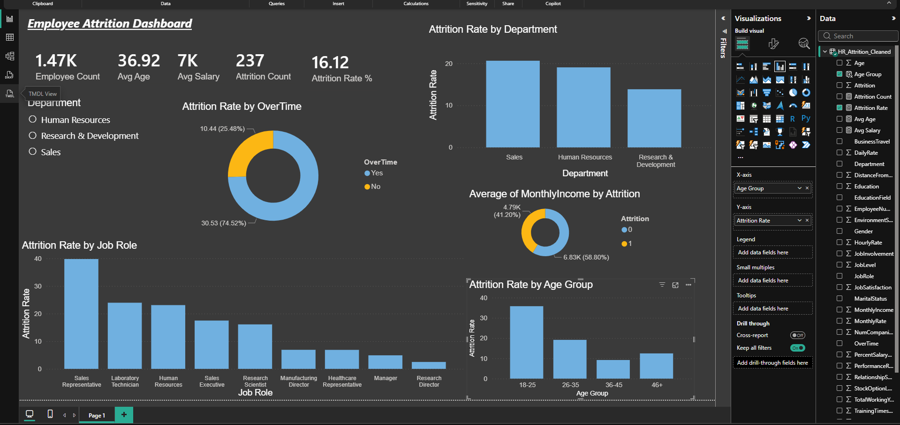

# Employee Attrition Prediction & HR Analytics Dashboard

## Dashboard Preview



---

## Project Overview

This project predicts employee attrition using Machine Learning and analyzes workforce trends through an interactive Power BI dashboard.

The goal is to help HR teams identify employees at risk of leaving and take proactive retention actions.

---

## Business Problem

Employee attrition leads to hiring costs, training costs, and productivity loss.  
Using HR data, this project identifies attrition patterns and predicts employee exits.

---

## Dataset

IBM HR Analytics Employee Attrition Dataset

- Total Records: 1470
- Features: 35 Columns
- Target Variable: Attrition (Yes / No)

---

## Tools & Technologies

### Python

- Pandas
- NumPy
- Matplotlib
- Seaborn
- Scikit-learn

### Power BI

- KPI Cards
- Interactive Filters
- Dashboard Visualizations

---

## Project Workflow

### 1. Data Preprocessing

- Null value check
- Blank value check
- Constant column removal
- Target encoding
- One-hot encoding
- Feature scaling

### 2. Exploratory Data Analysis

- Attrition by Department
- Attrition by Overtime
- Attrition by Job Role
- Attrition by Age Group
- Salary vs Attrition

### 3. Model Building

Models used:

- Logistic Regression
- Balanced Logistic Regression
- Random Forest Classifier

### 4. Model Evaluation

Metrics used:

- Accuracy
- Precision
- Recall
- F1 Score
- ROC AUC Score

---

## Final Results

- Balanced Logistic Regression improved recall for attrition employees.
- ROC AUC score showed good class separation performance.
- Power BI dashboard provided clear HR insights.

---

## Key Business Insights

- Employees doing overtime had higher attrition rate.
- Sales department showed highest attrition rate.
- Younger employees had higher tendency to leave.
- Some job roles had significantly higher attrition risk.
- Lower salary groups were more likely to leave.

---

## Power BI Dashboard Includes

- Employee Count
- Attrition Count
- Attrition Rate %
- Average Age
- Average Salary
- Attrition by Department
- Attrition by Overtime
- Attrition by Job Role
- Attrition by Age Group

---

## Project Files

- HR_Attrition_Project.ipynb
- HR_Attrition_Dashboard.pbix
- dashboard_screenshot.png
- hr_attrition_model.pkl
- scaler.pkl

---

## How to Run

Install required libraries:

```bash
pip install -r requirements.txt
